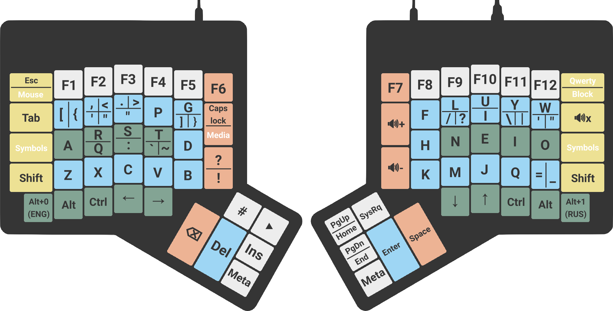
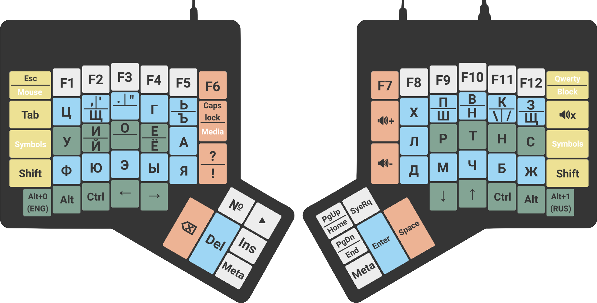
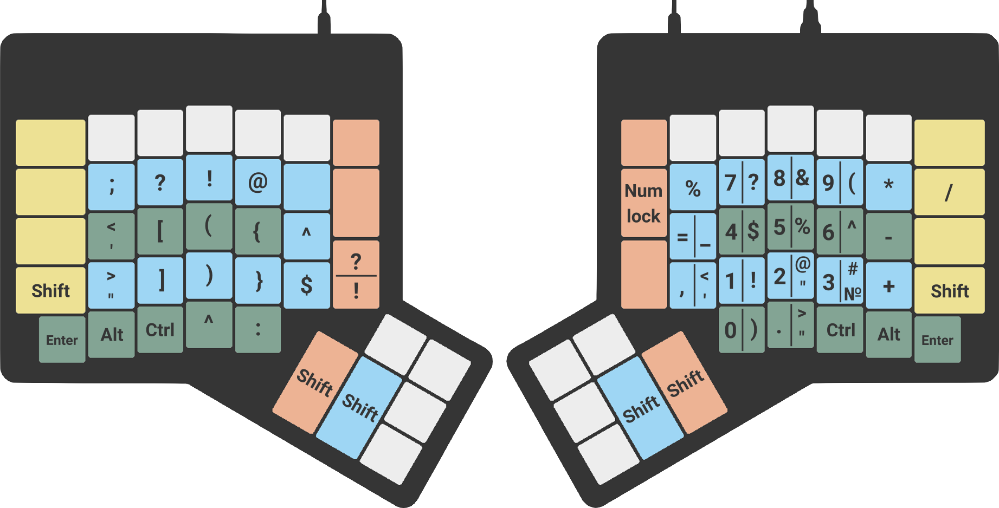

<div class="myWrapper" align="center" markdown="1">

# :musical_keyboard: ErgoDox Arst-Ртнс layout

*English-Russian layout for my ErgoDox keyboard*

[](https://github.com/zalimannard/ergodox-arst-rtns/issues)
[](https://github.com/zalimannard/ergodox-arst-rtns)
[](https://github.com/zalimannard/ergodox-arst-rtns/blob/main/LICENSE)
[-blueviolet)](https://boosty.to/zalimannard)

</div>

- The standard QWERTY and ЙЦУКЕН layouts are awful.
- The standard keyboard form factors are awful.

I assembled my keyboard according to the instructions from the [ErgoDox website](https://www.ergodox.io). 

I created the firmware via [ORYX](https://configure.zsa.io/ergodox-ez/layouts/WrnrR/latest/0). Here you can see the full information about the keyboard layers.

Previously, to change the language, I had to do 2 actions: change the layer and change the language in the system. It's annoying and takes up a button. Moreover, if the layer has an English layout, and the Russian language is on the computer, this causes confusion. Therefore, it was decided to make a layout that solves these misunderstandings.

The English layout is based on Colemak, Dvorak and Arensito. Russian is based on Dvorak and Redaktor. This program changes only the Russian layout, because the English layout is set in ORYX. Therefore, nothing will need to be done to use the English layout on a regular keyboard.

English layout:



Russian layout:



Symbol Layer:



## :computer: Adding to the system

I use Arch btw. If you needed to do this on other distribution, most likely the steps will be the same, but better check it out. If you use Windows, then I have bad news for you.

```shell
git clone https://github.com/zalimannard/ergodox-arst-rtns.git
cd ergodox-arst-rtns
./install.sh
```

After that, a new layout should appear in your desktop environment.

## :pencil: Licence

This project is licensed under [MIT](https://github.com/zalimannard/usuf-bot/blob/main/LICENSE) license.
